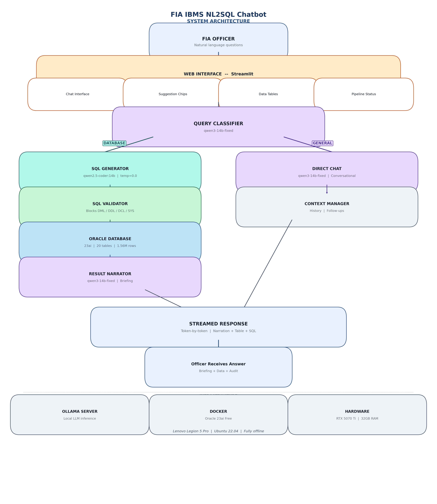
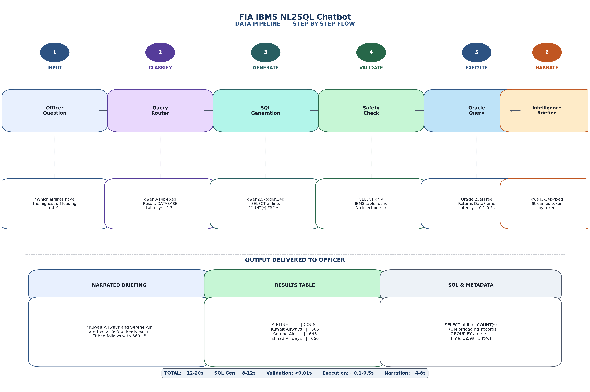
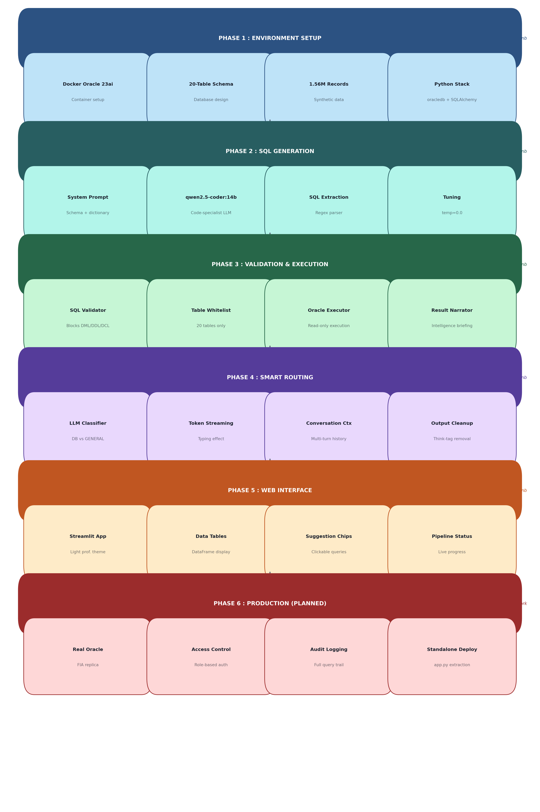

# 🔐 FIA-IBMS NL2SQL Chatbot

> A self-hosted, fully offline NL2SQL chatbot for Pakistan's Federal Investigation Agency (FIA). Officers ask questions in plain English, the system generates SQL, executes it on Oracle, and returns narrated intelligence briefings — zero cloud dependencies, zero data leakage.


---

## 📋 Project Status

- [x] Architecture finalized (NL2SQL, not RAG)
- [x] LLM models configured (`qwen2.5-coder:14b` + `qwen3-14b-fixed`)
- [x] Oracle 23ai Free in Docker — 20 tables, ~1.56M records
- [x] NL2SQL pipeline: generation → validation → execution → narration
- [x] Smart query routing (DATABASE vs GENERAL)
- [x] Token-by-token streaming output
- [x] Streamlit web UI (professional light theme)
- [ ] Formal evaluation & benchmarking
- [ ] Connect to real Oracle replica
- [ ] Role-based access control & audit logging

---

## 🏗️ Architecture

### System Architecture

<p align="center">
  
</p>

### Data Pipeline

<p align="center">
  
</p>

### Project Workflow

<p align="center">
  
</p>

### Why NL2SQL Instead of RAG?

IBMS contains **structured, numeric travel records** — not free text. Traditional RAG (embed → vector search) fails because passport numbers have no semantic meaning, dates can't be filtered by cosine similarity, aggregations (`COUNT`, `GROUP BY`) are impossible with embeddings, and exact matches need SQL, not "similar" results.

### How It Works

```
Officer: "Which airlines have the highest off-loading rate?"

[1] Classifier → DATABASE
[2] qwen2.5-coder generates:  SELECT airline, COUNT(*) FROM offloading_records GROUP BY airline
[3] Validator → PASS
[4] Oracle returns → 3 rows
[5] qwen3 narrates: "Kuwait Airways and Serene Air are tied at 665 offloads each..."
```

---

## 🔧 Tech Stack

| Component | Technology | Purpose |
|---|---|---|
| **SQL Generation** | `qwen2.5-coder:14b` via Ollama | Generates Oracle SQL from natural language |
| **Narration & Chat** | `qwen3-14b-fixed` via Ollama | Narrates results + general conversation |
| **Database** | Oracle 23ai Free (Docker) | 20 tables, ~1.56M rows |
| **Web UI** | Streamlit 1.52.2 | Professional chat interface |
| **Pipeline** | Custom Python (no LangChain) | End-to-end NL2SQL orchestration |
| **Security** | SQL validator + read-only user | Blocks writes, injections, system access |

### Dual Model Strategy

```
qwen2.5-coder:14b   → SQL generation (code specialist, temp=0.0)
qwen3-14b-fixed     → Classification + narration + general chat
                       (custom Modelfile: temp=0.7, repeat_penalty=1.5)
```

---

## 💻 Hardware

| Component | Specification |
|---|---|
| **Laptop** | Lenovo Legion 5 Pro |
| **GPU** | NVIDIA RTX 5070 Ti (12GB VRAM) |
| **RAM** | 32 GB |
| **OS** | Ubuntu 22.04 |

---

## 🗄️ Database Schema (20 Tables)

| Table | Records | Description |
|---|---|---|
| `travelers` | 100,000 | Passenger profiles |
| `travel_records` | 500,000 | Flight records |
| `document_registry` | 200,000 | Passports, CNICs |
| `visa_applications` | 150,000 | Visa records |
| `risk_profiles` | 100,000 | Automated risk scores |
| `family_relationships` | 50,000 | Family links |
| `audit_log` | 400,000 | System activity |
| `offloading_records` | 10,000 | Off-loaded passengers |
| `watchlist` | 10,000 | Alert entries |
| `sponsors` | 10,000 | Visa sponsors |
| + 10 more tables | ~26,000 | ECL, asylum, detention, trafficking, etc. |

---

## 📊 Test Results

| Query | Result | Time |
|---|---|---|
| Off-loaded passengers at Islamabad 2025 | ✅ 100+ rows | 16.8s |
| Airlines with highest off-loading rate | ✅ 3 rows | 12.9s |
| Active watchlist alerts | ✅ 6,378 | 11.7s |
| Top 10 frequent travelers | ✅ 10 rows | 19.0s |
| Off-loading rates across airports | ✅ 7 rows | 19.6s |

**Success rate: 5/5 (100%)**

---

## 📂 Project Structure

```
IBMS_LLM/
├── Config/
│   ├── prompt_template.txt
│   └── nb03_test_results.json
├── notebooks/
│   ├── 01_oracle_setup.ipynb
│   ├── 02_system_prompt_sql.ipynb
│   ├── 03_sql_validation_narration.ipynb
│   ├── 04_gradio_ui.ipynb
│   └── 05_streamlit_ui.ipynb
├── data/
│   └── mock/
├── workflow/
│   ├── diagram_1_project_workflow.png
│   ├── diagram_2_architecture.png
│   ├── diagram_3_data_pipeline.png
│   └── generate_diagrams.py
├── app.py
├── requirements.txt
├── .gitignore
└── README.md
```

---

## 🏃 Quick Start

```bash
# 1. Start Oracle
docker start oracle-ibms

# 2. Launch app
cd ~/ml-projects/python-projects/IBMS_LLM
source ~/ml-projects/ml-env/bin/activate
streamlit run app.py --server.port 8501

# 3. Open http://localhost:8501
```

---

## ⚙️ Ollama Model Setup

```bash
ollama pull qwen2.5-coder:14b

cat > /tmp/Modelfile-qwen3-fixed << 'EOF'
FROM qwen3-14b:latest
PARAMETER temperature 0.7
PARAMETER top_p 0.8
PARAMETER top_k 20
PARAMETER repeat_penalty 1.5
PARAMETER stop <|im_start|>
PARAMETER stop <|im_end|>
TEMPLATE """{{- range .Messages }}
{{- if eq .Role "system" }}<|im_start|>system
{{ .Content }}<|im_end|>
{{ end }}
{{- if eq .Role "user" }}<|im_start|>user
{{ .Content }}<|im_end|>
{{ end }}
{{- if eq .Role "assistant" }}<|im_start|>assistant
{{ .Content }}<|im_end|>
{{ end }}
{{- end }}<|im_start|>assistant
"""
EOF
ollama create qwen3-14b-fixed -f /tmp/Modelfile-qwen3-fixed
```

---

## 🔗 Related Projects

- **[LocalLLM-RAG](https://github.com/maliciit-sys/LocalLLM-RAG)** — Previous project: Self-hosted RAG pipeline using PostgreSQL + pgvector + Ollama.

---

## 📝 License

Internal project for FIA Pakistan.
